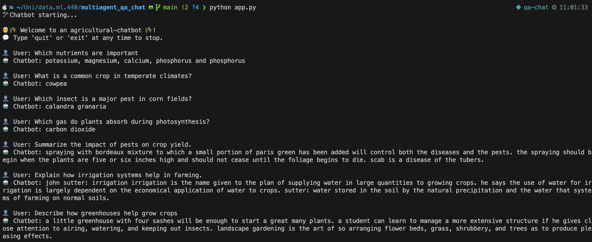

# multiagent_qa_chat
Course work for data.ml.440

## Overview
multiagent_qa_chat is a coursework project for `data.ml.440` that combines retrieval-based and summarization-based approaches to answer domain-specific agricultural questions. It uses Dense Passage Retrieval (DPR) for fetching relevant information and a fine-tuned [T5-small model](https://huggingface.co/google-t5/t5-small) for summarizing responses. The question answering is done with [DistilBERT base cased distilled model](https://huggingface.co/distilbert/distilbert-base-cased-distilled-squad) trained on SQuAD -dataset.

## The DPR Data
The data consists of 7 agricultural ebooks from [Project Gutenberg](https://www.gutenberg.org/):
- [Pleasant Talk About Fruits, Flowers and Farming by Henry Ward Beecher](https://www.gutenberg.org/ebooks/56640)
- [Field, Forest and Farm by Jean-Henri Fabre](https://www.gutenberg.org/ebooks/67813)
- [Agriculture for Beginners by Burkett, Hill, and Stevens](https://www.gutenberg.org/ebooks/20772)
- [Science and Practice in Farm Cultivation by James Buckman](https://www.gutenberg.org/ebooks/40190)
- [Dry-Farming : A System of Agriculture for Countries under a Low Rainfall by Widtsoe](https://www.gutenberg.org/ebooks/4924)
- [The Farm That Won't Wear Out by Cyril G. Hopkins](https://www.gutenberg.org/ebooks/4525)
- [Science and Practice in Farm Cultivation by James Buckman](https://www.gutenberg.org/ebooks/40190)

## Notebooks
*Notebooks require CUDA or MPS for optimal performance. The code might have to be tweaked to enable efficient computation on your local machine*.
- `dense-passage-retrieval.ipynb` embedds passages and stores FAISS indexes using Facebook DPR models.
- `summarization-model.ipynb` fine-tunes T5 model on CNN / DailyMail dataset for summarization and uploads the model to HuggingFace.

## Setup
1. Run `pip install -r requirements.txt` to install dependencies.
2. Run `dense-passage-retrieval.ipynb` notebook for setting up the DPR files.
3. Run `app.py` in command line to interact with the bot.

## Demo:
Here are some domain specific conversations to try with the bot:
### Questions:
- "What are common animals in farm"
- "What does fertilizers contain"
- "What is a common crop in temperate climates?"
- "Which nutrients are important"
- "Which insect is a major pest in corn fields?"
- "Which gas do plants absorb during photosynthesis?"

### Summaries: 
- "Describe irrigation"
- "Tell me about crop rotation"
- "Summarize the impact of pests on crop yield."
- "Explain how irrigation systems help in farming."
- "Describe how greenhouses help grow crops"

### Demo as a picture:

